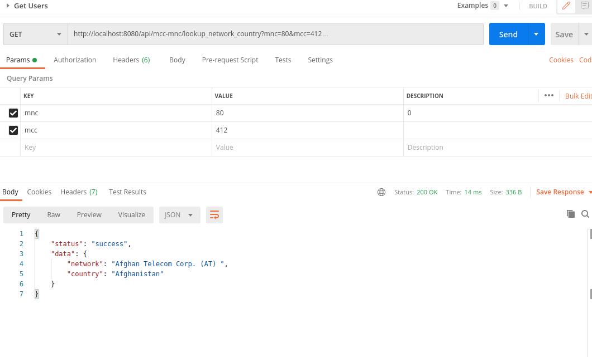

# Node Js scrapping with REST API

A project that scrapes a website. Stores the table data into a Json file. A GET rest api that queries the JSON file

## Install dependencies

By default, dependencies were installed when this application was generated. Whenever dependencies in `package.json` are changed, run the following command:

```sh
npm install
```

## Run the application

To start the projects first run scrapper file on root to crawl the website and store the data on data,json file

run

```sh
node  scrapper.js
```

Once the data.json is created next is to run our REST API

```sh
npm start
```

Open http://127.0.0.1:8080 in your browser.

## Test the endpoints

The project has two endpoints

1.  GET /api/mcc-mnc/lookup_network_country It takes two mandatory query params with name mcc and mnc which are used to get the country matching them. It returns an object having the country and network.

    ### Example Request Response

    

2.  GET /api/mcc-mnc/lookup_allnetwork

    It takes 2 query params mcc or country and returns array of the networks present on those country or mcc field

    


